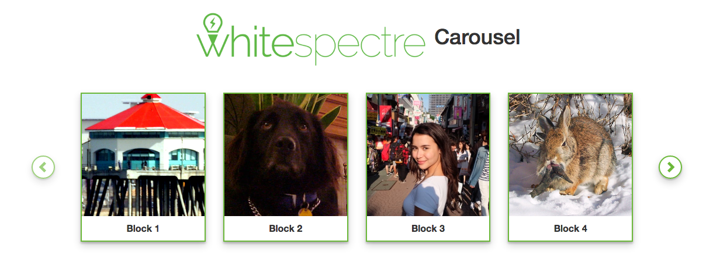

# Carousel with BackboneJS

---

## Description

This is a basic carousel developed with backboneJS. The source for this carousel is an endpoint (also created on this project) that serves a JSON like this:

    [{
      title: "First Block",
      images: [url1, url2, url3]
     },
     {
      title: “Second Block",
      images: [url7, url8]
     }
     ,...]

